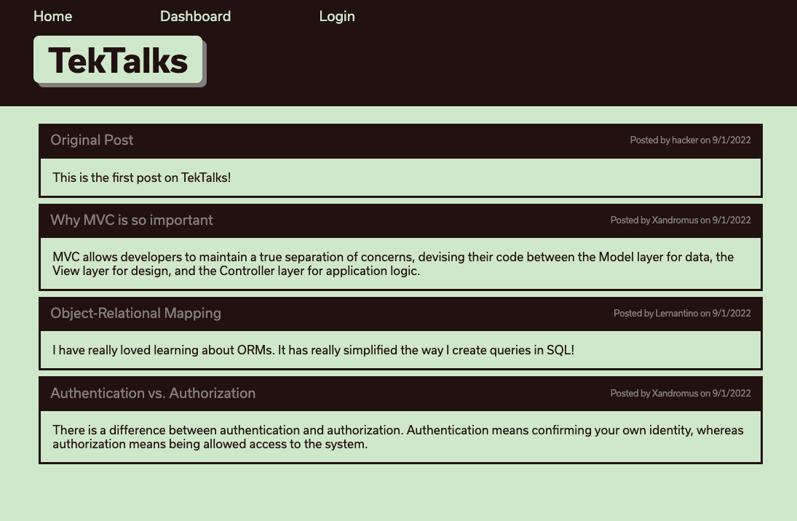
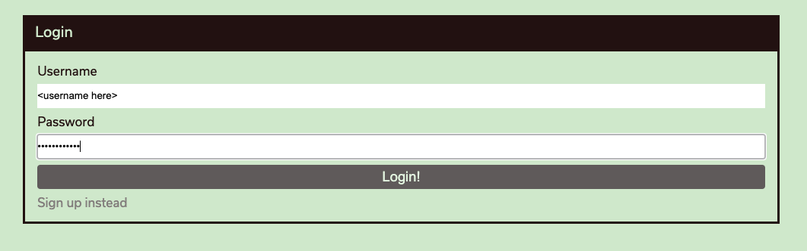
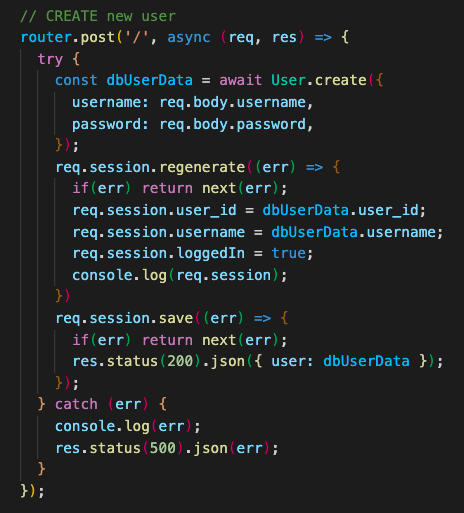
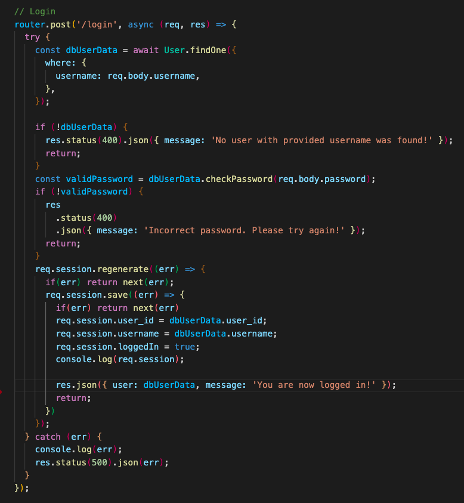
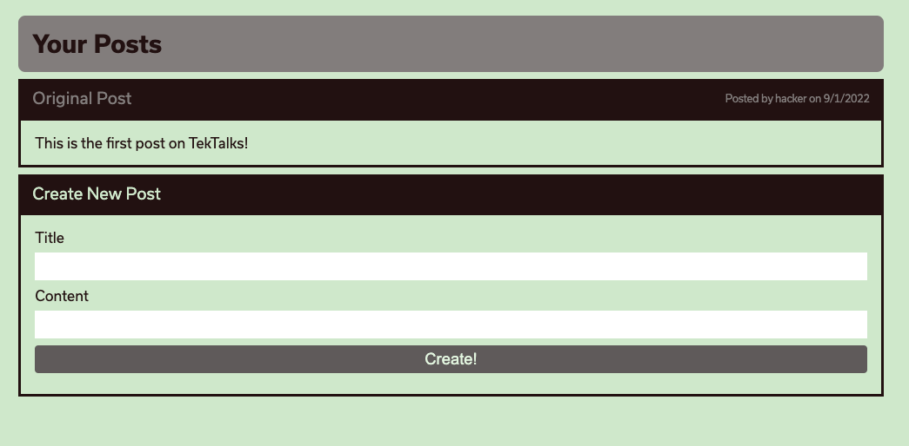
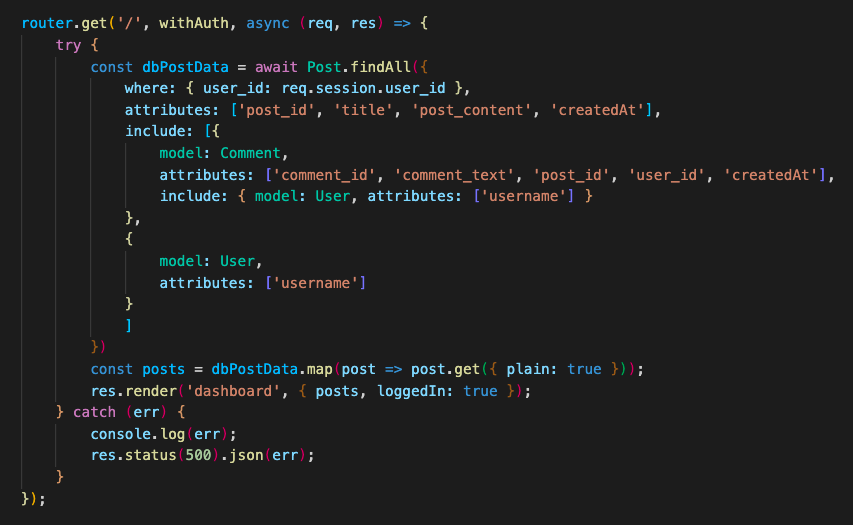
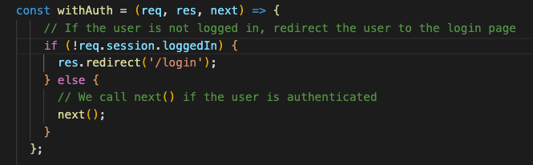

# <a href="https://tektalkblog.herokuapp.com/"></a>


## Description
TekTalks is a blog site, similar to a wordpress site.

    Writing about tech can be just as important as making it. Developers spend plenty of time creating new applications and debugging existing codebases, but most developers also spend at least some of their time reading and writing about technical concepts, recent advancements, and new technologies. A simple Google search for any concept covered in this course returns thousands of think pieces and tutorials from developers of all skill levels!

The development of TekTalks required quite a bit of managing technologies. It was a very useful exercise for me as a developer, and I can already see the benefit as I move into working with ODM's. I struggled more than expected with the routes, and because of that struggling I really believe that I understand it all just that much better.


<br/>

## Table of Contents

* **[Installation](#installation)**<br />
* **[Usage](#usage)**<br />
* **[License](#license)**<br />
* **[Contributing](#contributing)**<br />
* **[Contact](#contact)**<br />

### Installation
<a name="installation"/>

```
npm i
```

### Usage
<a name="usage"/>
You will need to create a user by navigating to login, and selecting "signup". You will automatically be redirected to your dashboard, where you will be able to see, update, and even delete your future posts! Feel free to go ahead and create one. Once logged in, you can view all the posts and even comment with other users on various posts! The limit is really up to you and your post writing.<br/>

<br/>
<br/>
<br/>
<br/>
<br/>



### License
<a name="license"/>

<a href="https://choosealicense.com/licenses/mit/">mit</a><br/>
            For more information on the coverage of this license please click on the link above.


### Contributing
<a name="contributing"/>
hackpres is the primary contributor.


### Contact
<a name="contact"/>
for questions please contact <a href="https://github.com/hackpres">hackpres</a><br/>

